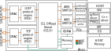
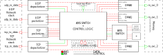

# What is ACCL_Offload?
  > The Message Passing Interface, is a standardized and portable message-passing system designed to function on a wide variety of parallel computers [MPI](http://mpi-forum.org/), [mpi-using](https://mpi4py.readthedocs.io/en/stable/intro.html#mpi-using) [mpi-ref](https://mpi4py.readthedocs.io/en/stable/intro.html#mpi-ref). The standard defines the syntax and semantics of library routines and allows users to write portable programs in the main scientific programming languages (Fortran, C, C++, ecc.. ).

  [Source](https://mpi4py.readthedocs.io/en/stable/intro.html)

ACCL (Accelerated Collective Communication Library Offload) project aims at extending MPI to hardware by offering a number of FPGA-accelerated Collective that can be invoked by both kernel/RTL designs in order to scale your application over multiple FPGAs.

This repository assembles a system of Vitis kernels which can perform MPI-like communication over direct FPGA-to-FPGA Ethernet.

## Supported communication primitives
- send and receive
- broadcast
- scatter, gather, and allgather
- reduce and allreduce


# Table of contents

- [How to use it](#How-to-use-it)
- [What it is](#What-it-is)
- [How to communicate with it](#How-to-communicate-with-it)
- [How it is implemented](#How-it-is-implemented)
- [How to build it](#How-to-build-it)
- [How to integrate it](#How-to-integrate-it)

# How to use it
You can offload to ACCL the collectives you need to execute.
As a first step you need to configure it. This step include 1) describing the MPI communicator in which it will be employed 2) allocating a part of the DDR memory as reserved for ACCL usage.
At this point, you will use the ACCL driver(through python PYNQ or directly via XRT) to request a collective. Depending on the collective you will need to provide one or multiple buffers located inside the FPGA off-chip memory (DDR/HBM).
ACCL will move data for you and the ranks involved in the collective would end up with the data in their buffers.

Example with Python driver:
````
from pynq import Overlay, allocate
from mpi4py import MPI
#receive binfile, ranks_dict as inputs
ol = Overlay(binfile)
accl = ol.cclo
rank = MPI.COMM_WORLD.Get_rank()
bs = 16384

accl.setup_rx_buffers(nbufs=16, bufsize=bs, devicemem=ol.bank0)
accl.configure_communicator(ranks_dict, rank)
accl.open_port(); accl.open_con() 

txb=allocate((bs,), target=ol.bank0)
rxb=allocate((bs,), target=ol.bank0)

if rank==0:
    accl.recv(rxb, src=1, tag=1, to_fpga=True)
elif rank==1:
    accl.send(txb, dst=0, tag=1, from_fpga=True)
    
ch = accl.allreduce(txb, rxb, count=256, async=True)
accl.allgather(txb, rxb, count=256, waitfor=[ch])

accl.deinit() #releases FPGA memory, resets CCLO
````
### Example explanation
1. Allocate and configure a set of buffers required for ACCL operation in the  FPGA  memory
2. Construct  the communicator according to rank information from mpi. In this example,we  utilize  the  python  package mpi4py to  determine  the  local rank ID when the application has been launched with mpirun. All configuration information is stored in the FPGA so that the CCLO can rapidly access them. 
3. Afterwards, the user can issue  commands  to  open  connections  between  each  ranks  in the communicator via the protocol offload engine.
 
As  with  MPI,  most  ACCL  collectives  take  two  buffers  as arguments:
-  one (source buffer) holds the to-be-communicated data (line 13), 
- while the the other (destination buffer) specifies where  to  store  the  results  (line  14).  

Lines  16-19  implement data movement from rank 1 to rank 0.  

#### (to/from)fpga
Each  ACCL  function  allows  users  to  specify  whether each  of  the  buffers  reside  in  the  host  or  in  FPGA  off-chip memory  (tofpga/fromfpga).  If  required,  the  ACCL  driver handles  data  movement  between  host  and  FPGA  external memories. However, when ACCL is used in conjunction with user  FPGA  kernels,  the  additional  data  movement  is  not required, reducing latency. 

#### chaining 
When multiple collective primitives are issued in a single application, additional latency reduction can  be  achieved  by  utilizing  asynchronous  calls  and  call chaining,  a  feature  of  XRT  which  the  ACCL  drivers  expose up  to  application  code.  When  an  ACCL  collective  is  called asynchronously,  it  returns  immediately  a  handle  to  the  XRT descriptor (ch on line 21) of the on-going collective. Chaining occurs  when  the  invocation  of  one  FPGA  kernel  depends on  the  completion  of  a  different  invocation  to  the  same  or other  FPGA  kernel.  ACCL  collectives  also  allow  for  these dependencies to be specified (see line 22) and passed down to the Xilinx Embedded Run-Time, a hardware scheduler which starts  the  collective  immediately  after  the  dependencies  have been  resolved,  with  typical  latency  in  the  nanosecond  range.Using these mechanisms, users can define execution chains of arbitrary  length  which  involve  any  ACCL  collective  and  any user FPGA kernels.

# Overview


ACCL is a combination  of  software  running  on  the  host  CPU,  FPGA data-moving  hardware,  and  control  firmware  executing  ona  FPGA-embedded  microcontroller.  Figure  1  illustrates  an high  level  overview  of  the  ACCL  structure.  In  the  FPGA, ACCL   features   a   collectives   offload   engine   (``CCLO``)   an done  or  more  network  protocol  offload  engines  (``POE``),  each of  which  is  implemented  as  a  stand-alone  Vitis  kernel.  The ``CCLO``  implements  the  collectives  on  top  of  ``TCP/IP``  or  ``UDP``. The  protocol  offload  engines  implements  the  full  network stack  up  to  ``UDP``  and  ``TCP/IP``  respectively  and  connect  directly to  Ethernet  ports,  e.g.  through  Alveo  Gigabit  Transceivers and  ``QSFP28``  ports. The  host  communicates  with  the  CCLO  over  ``PCIe`` and  ``Xilinx  XDMA``,  but  this  complexity  is  hidden  by  XRT and  our  drivers.  The  distributed  application  that  runs  on,possibly  multiple,  hosts  leverages  the  ACCL  [Python](../driver/pynq/cclo.py)  or  [C++](../driver/xrt/src/) driver  to  control  the  CCLO.  
More info on CCLO [here](#How-it-is-implemented) 
# How to communicate with it


## Hardware interface
The host communicates with the CCLO through a 8kB IO space which starts at ``BASEADDR`` and is implemented by the ``s_axi_control`` port.
Moreover, the CCLO modifies the FPGA off-chip memory in the DDR through two AXI4 MMAP master, namely ``m_axi_0``, ``m_axi_1``, ```m_axi_2``.
It then communicates with the network stack through ``net_rx``, ``net_tx`` AXI Stream ports to send and receive messages from other ACCL_Offload instances.
The following table reports the ACCL_Offload interfaces and their main parameters.

name          | port type           | range              | data width   
-----         |------               |-------             |-----------   
s_axi_control | addressable slave   | 8192 B (8 KB)      | 32         
m_axi_0       | addressable master  | 17,179,869,184 GB (16 EXAB) | 512        
m_axi_1       | addressable master  | 17,179,869,184 GB (16 EXAB) | 512   
m_axi_2       | addressable master  | 17,179,869,184 GB (16 EXAB) | 512        
net_rx        | stream              | n.a                | 512       
net_tx        | stream              | n.a                | 512         

[Source: kernel/ccl_offload_ex/imports/kernel.xml](../kernel/ccl_offload_ex/imports/kernel.xml)

## Software interface

The MPI_Offload communicate with the host through a 4kB IO space which starts at ``BASEADDR`` and is implemented by the ``s_axi_control`` port.
The IO space is divided into 2 sections:

1. Control and arguments section, from address 0 to 0x7FF. The purpose of this region is to pass arguments and ACCL_Offload status back and forth from the user. 
2. RX buffers configuration,  from address 0x1000 to 0x1FFF. This memory stores information about :
  -  ``spare_buffers`` that the ACCL_Offload can use to temporary store data that comes from the network stack that the user has not claimed yet.
  - Communication configuration
  - Miscellaneous data.

More info at [kernel_interfaces.md](kernel_interfaces.md).

# How it is implemented

The  CCL  Offload  (CCLO)  kernel  implements  the  ACCL primitives  by  orchestrating  data  movement  between  the  net-work  fabric,  FPGA  external  memory,  and  FPGA  compute kernels, with no host CPU involvement. Data movement to and from  the  network  is  accomplished  through  custom  interface blocks  to  the  TCP/UDP  network  protocol  offload  engines,while  FPGA  external  memory  (DDR  or  HBM)  is  read  and written through DataMover engines (DMA). The following image gives a top-level overview of the CCLO.



the  CCLO  consists  of  
  - three [AXI DataMovers](https://www.xilinx.com/support/documentation/ip_documentation/axi_datamover/v5_1/pg022_axi_datamover.pdf) engines (DMA0, DMA1,DMA2)
  -   [AXI  Stream  (AXIS)  interconnects](https://www.xilinx.com/support/documentation/ip_documentation/axis_infrastructure_ip_suite/v1_1/pg085-axi4stream-infrastructure.pdf),  
  - an internal arithmetic unit 
  - network interface logic (UD,UP, TP, TD).
  Data flows through all those components via 512bit wide AXIS interfaces [15], that are connected together via the central AXIS Switch.

  - The ``CTRL`` module orchestrates the movement of information inside the ACCL_Offload, and therefore it ultimately implements the MPI collectives. 

  
  The ACCL_Offload relies extensively on AXI protocols (both MMAP and STREAM) and on several Xilinx IPs to exchange data. If you need more info on the protocol go to [AXI MMAP spec](https://developer.arm.com/docs/ihi0022/e?_ga=2.67820049.1631882347.1556009271-151447318.1544783517), [AXI STREAM spec](https://developer.arm.com/docs/ihi0051/latest), [UG761](https://www.xilinx.com/support/documentation/ip_documentation/axi_ref_guide/latest/ug761_axi_reference_guide.pdf) and [UG1037](https://www.xilinx.com/support/documentation/ip_documentation/axi_ref_guide/latest/ug1037-vivado-axi-reference-guide.pdf).

More info at [../kernel/readme.md#Architecture](../kernel/readme.md#Architecture).

# How to build it
The CCLO build process is automated and organized via Makefiles that are distributed across the repo. The build process is split into 2 steps:

1. building the CCLO IP. The main Makefile is [../kernel/Makefile](/kernel/Makefile). After this process an ``ccl_offload.xo`` file would be created under ``../kernel/ccl_offload_ex/exports``. 
For more info on how the Makefile works take a look in [../kernel/readme.md# Building and package the ccl_offload.xo Kernel](../kernel/readme.md#Building-and-package-the-ccl_offload.xo-Kernel).
2. Building the network stack and link against CCLO. The main Makefile is [../demo/build/Makefile](../demo/build/Makefile).

You can find info on how to build under [../demo/build](../demo/build).

Alveo shell currently supported:

- ``xilinx_u250_gen3x16_xdma_3_1_202020_1``
- ``xilinx_u280_xdma_201920_3``

# How to integrate it

Once you have built CCL_Offload and packaged into an IP, you can include it in 
your Vitis ``config.ini`` file in order to connect it to other kernels.
Here follows an example of config file.

````
[connectivity]
# Define number of kernels and their name
nk=network_krnl:1:network_krnl_0
nk=ccl_offload:1:ccl_offload_0
nk=cmac_krnl:1:cmac_krnl_0
nk=vnx_loopback:2:lb_str_0.lb_udp_0
nk=reduce_arith:1:external_reduce_arith_0

# Connect CCL Offload kernel to TCP Network Kernel
sc=network_krnl_0.m_axis_tcp_port_status:ccl_offload_0.s_axis_tcp_port_status:512
sc=network_krnl_0.m_axis_tcp_open_status:ccl_offload_0.s_axis_tcp_open_status:512
sc=network_krnl_0.m_axis_tcp_notification:ccl_offload_0.s_axis_tcp_notification:512
sc=network_krnl_0.m_axis_tcp_rx_meta:ccl_offload_0.s_axis_tcp_rx_meta:512
sc=network_krnl_0.m_axis_tcp_rx_data:ccl_offload_0.s_axis_tcp_rx_data:512
sc=network_krnl_0.m_axis_tcp_tx_status:ccl_offload_0.s_axis_tcp_tx_status:512
sc=ccl_offload_0.m_axis_tcp_listen_port:network_krnl_0.s_axis_tcp_listen_port:512
sc=ccl_offload_0.m_axis_tcp_open_connection:network_krnl_0.s_axis_tcp_open_connection:512
sc=ccl_offload_0.m_axis_tcp_read_pkg:network_krnl_0.s_axis_tcp_read_pkg:512
sc=ccl_offload_0.m_axis_tcp_tx_meta:network_krnl_0.s_axis_tcp_tx_meta:512
sc=ccl_offload_0.m_axis_tcp_tx_data:network_krnl_0.s_axis_tcp_tx_data:512

#Connect Network Kernel to CMAC Kernel
sc=cmac_krnl_0.axis_net_rx:network_krnl_0.axis_net_rx
sc=network_krnl_0.axis_net_tx:cmac_krnl_0.axis_net_tx
stream_connect=ccl_offload_0.m_axis_udp_tx_data:lb_udp_0.in
stream_connect=lb_udp_0.out:ccl_offload_0.s_axis_udp_rx_data

# Connect external reduce_arithmetic unit
stream_connect=external_reduce_arith_0.out_r:ccl_offload_0.s_axis_arith_res
stream_connect=ccl_offload_0.m_axis_arith_op0:external_reduce_arith_0.in1
stream_connect=ccl_offload_0.m_axis_arith_op1:external_reduce_arith_0.in2

# Connect external streaming kernel
stream_connect=ccl_offload_0.m_axis_krnl:lb_str_0.in
stream_connect=lb_str_0.out:ccl_offload_0.s_axis_krnl

````

An example on how to integrate the CCLO and the network stack is given at [../demo/Makefile](/demo/Makefile).